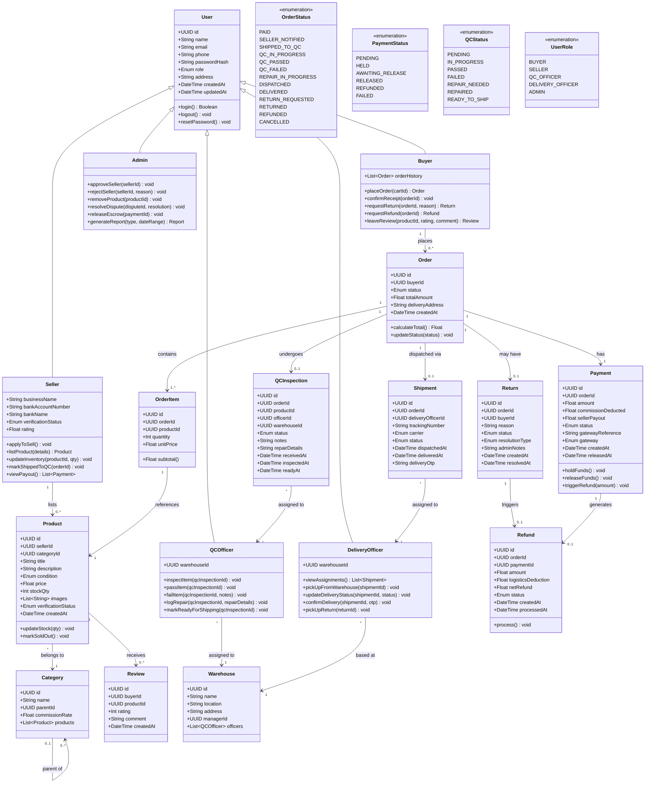

# Kube — Class Diagram

Render with any Mermaid-compatible tool (VS Code Mermaid plugin, mermaid.live, GitHub markdown).

---

## Key Design Decisions

| Decision | Rationale |
|----------|-----------|
| Single `User` base class with role enum | Simplifies auth — one login system for all roles |
| Separate `Return` and `Refund` entities | Return is a physical process; refund is a financial event — they are distinct |
| `Payment` holds both gross amount and seller payout | Commission deducted at escrow release, not at payment time |
| `QCInspection` linked to both `Order` and `Product` | An order item's QC result is traceable per product per order |
| `OrderStatus` has granular states | Needed to reflect real-world QC workflow stages |
| `Warehouse` entity | Multi-city QC units from day one by design |
