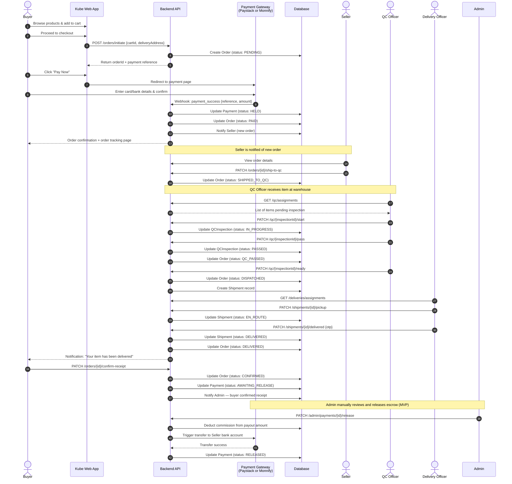
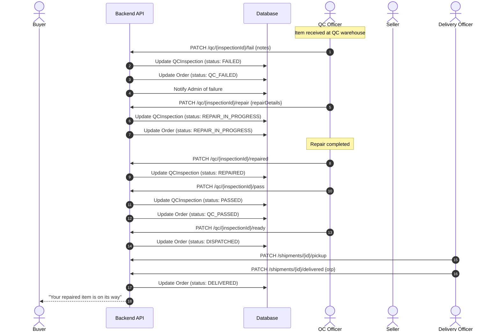
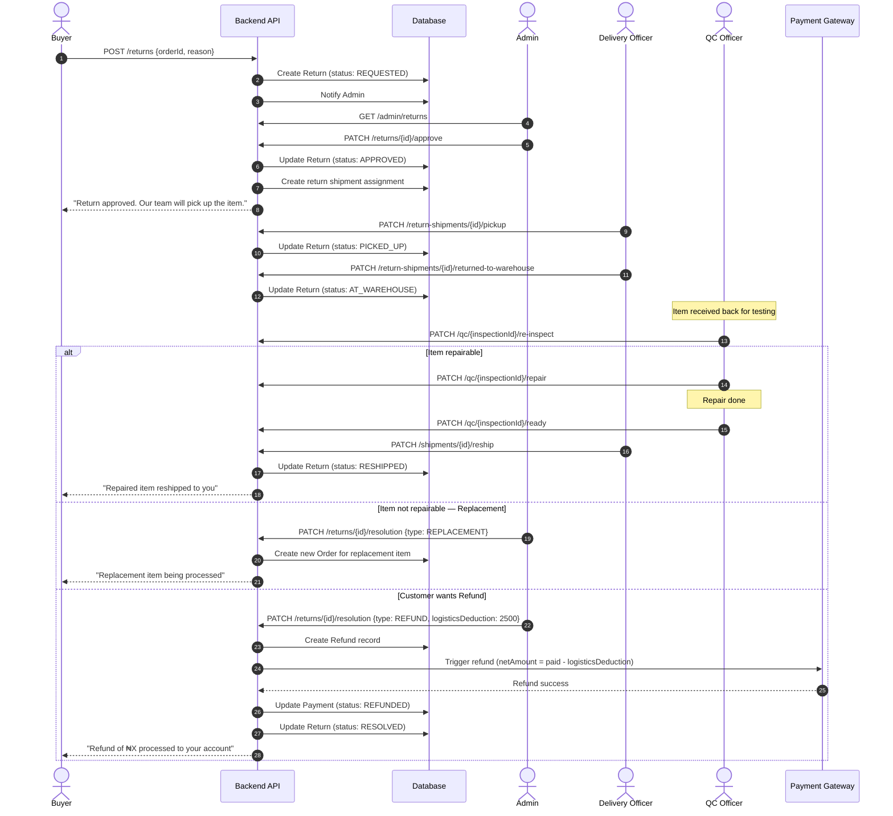
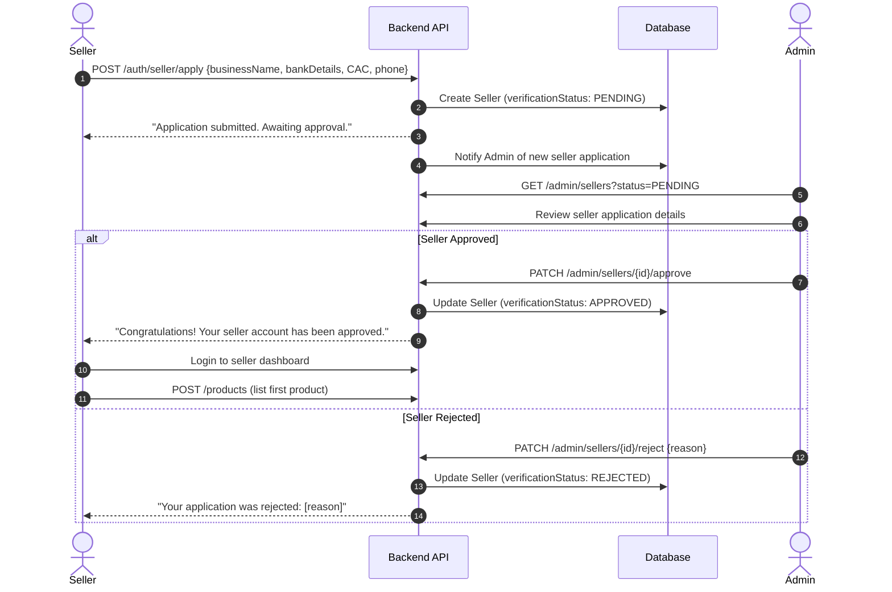

# Kube — Sequence Diagrams

Render with any Mermaid-compatible tool.

---

## Sequence 1: Successful Purchase Flow

---

## Sequence 2: QC Failure → Repair → Reship

---

## Sequence 3: Return & Refund Flow

---

## Sequence 4: Seller Onboarding (Admin Approval)

