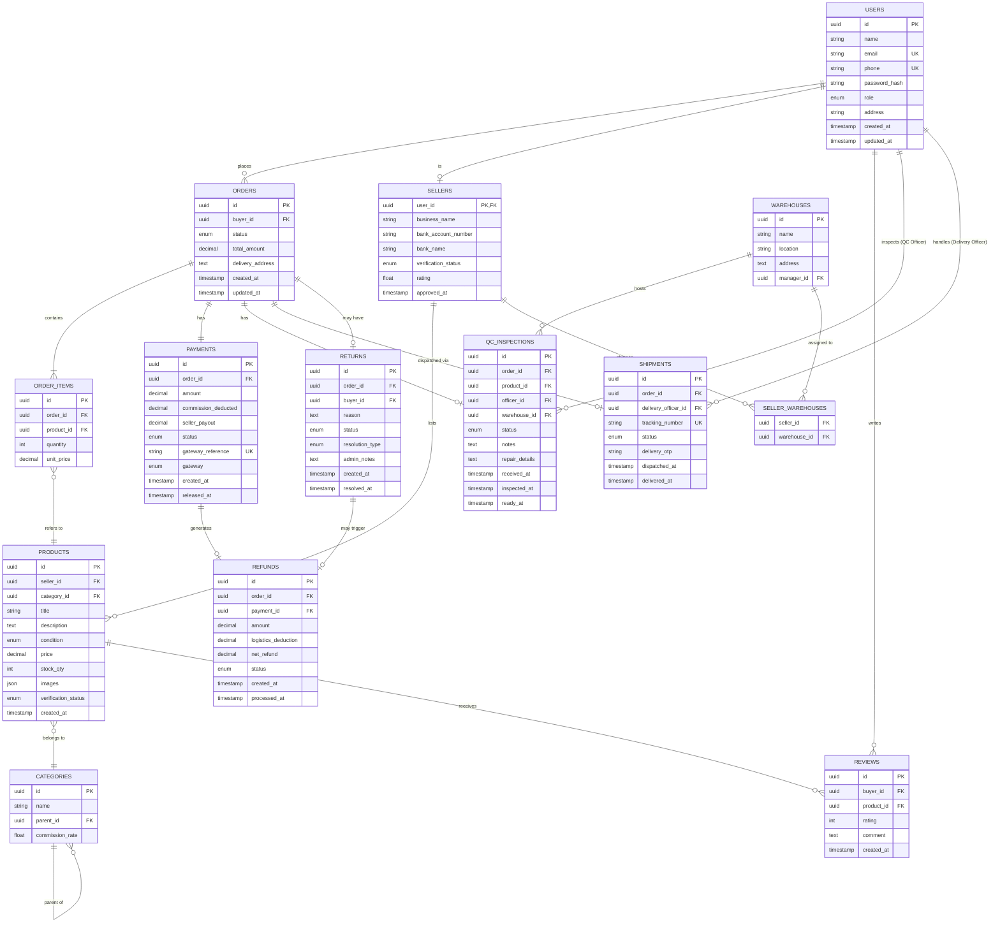

# Kube — Entity Relationship (ER) Diagram

---

## Database Notes

| Table | Notes |
|-------|-------|
| `users` | Single table for all user types; role enum distinguishes them |
| `sellers` | One-to-one extension of users (only exists if user is a seller) |
| `payments` | Stores both gross and net amounts; commission is deducted at release |
| `qc_inspections` | One per order item at MVP; can become one-per-item in Phase 2 |
| `seller_warehouses` | Many-to-many: a seller may ship to multiple QC warehouses by city |
| `categories` | Self-referencing for subcategory support (e.g., Electronics > Phones) |
| `orders` status | Tracks the full lifecycle — see OrderStatus enum in class diagram |
| `payments` status | AWAITING_RELEASE is set after buyer confirms receipt; admin manually triggers RELEASED at MVP |
| `categories` commission_rate | Commission is configured per category by admin (BR-10), not per seller |
